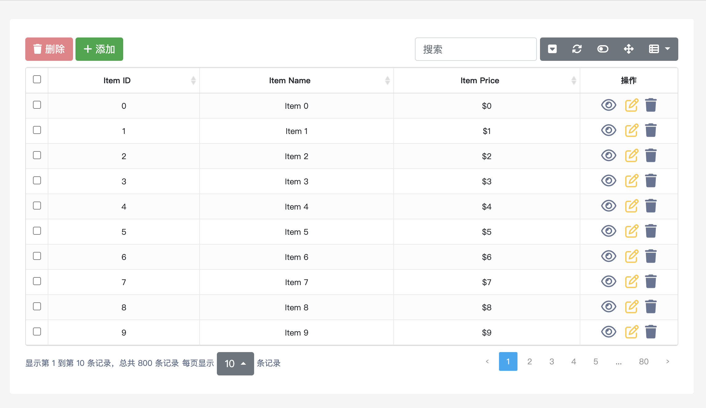
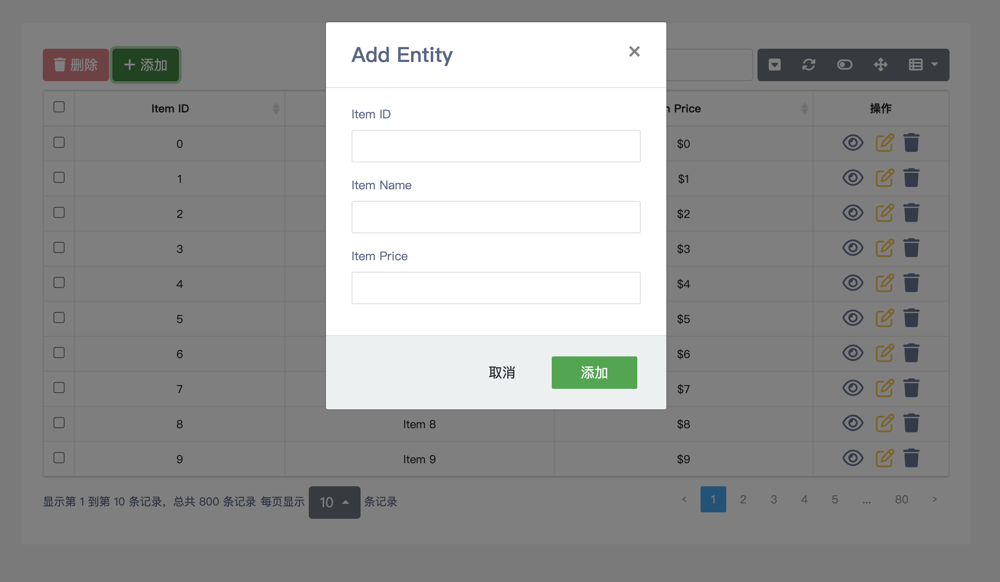

# bootstrap-table-crud-template
## 模板介绍
该模板诞生于2023年12月15日，基于 Bootstrap 技术实现的增删改查界面。通过集成 bootstrap-table 插件，快速实现强大的单选、多选、排序、分页，以及编辑、导出、过滤（扩展）等功能。
这个模板特别适合 Web 初学者，可以帮助大家快速实现对数据库中数据的呈现和操作。

## 技术栈
- HTML 
- CSS 
- JavaScript 
- jQuery 3.5.1 
- Bootstrap 4.5.0 
- Bootstrap-table 1.13.1 
- Font Awesome 6.5.1

## 演示
- **表格列表界面**

- **CRUD 界面**

## 使用方法
- 1.将模板文件下载或克隆到本地环境。
- 2.打开 index.html 文件以查看主页面。
- 3.根据需要进行定制修改，例如更改样式、添加新功能或集成后端数据。

## 功能特点
- 强大的表格功能： 使用 bootstrap-table 实现单选、多选、排序、分页等表格功能。
- 可编辑表格： 支持在表格中直接编辑数据，实时更新到数据库。
- 导出数据： 提供导出功能，方便用户将数据以不同格式保存。
- 过滤扩展： 可以根据需要扩展过滤功能，使用户能够更精确地筛选数据。

## 注意事项
在开始使用之前，请确保你已经正确安装了浏览器，并且网络环境良好。
模板提供了基本的功能，但你可能需要根据具体项目的需求进行定制和扩展。

## 贡献
欢迎贡献代码、提出问题或者提供改进建议。我们希望这个模板能够成为一个学习和实践的好工具。

## 许可证
该模板采用 [MIT 许可证](https://github.com/wukongnotnull/bootstrap-table-crud-template/blob/main/LICENSE) 进行许可。请在使用前仔细阅读许可证内容。
